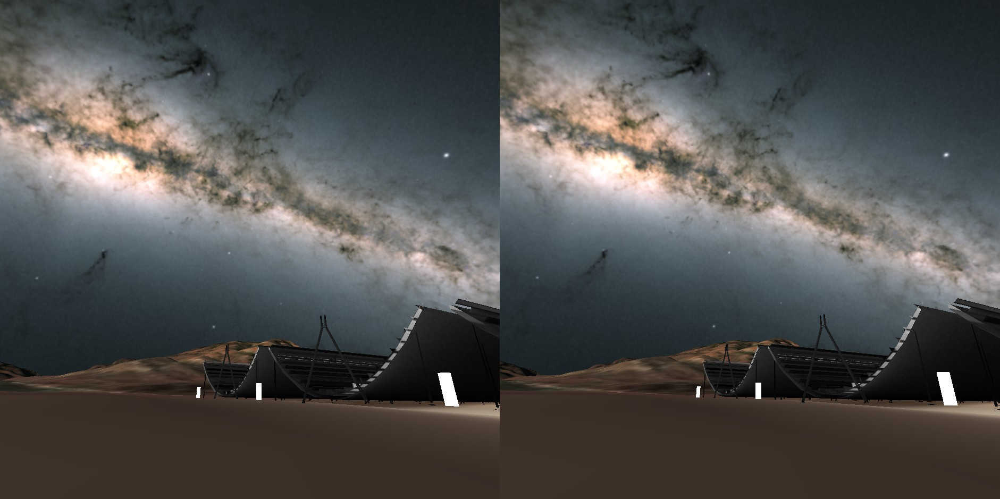

# Threejs-VR-Astronomical-Observatories
An experiment to recreate VR experience of astronomical observatories around the world.

# Hardware

Oculus Quest (tested Quest One, update 35.0, Oculus browser 18.0) 

(may work on other VR headsets with Chrome 96.0 and Firefox 94.0) 

# Installation

No installation. In Oculus Quest, open Oculus Browser and: 

# Credits
 
ESA\_Gaia\_DR2\_AllSky\_Brightness\_Colour\_Cartesian\_2000x1000.png 
Date: 25 April 2018 
Satellite: Gaia 
Copyright: ESA/Gaia/DPAC, CC BY-SA 3.0 IGO 
[http://sci.esa.int/gaia/60196-gaia-s-sky-in-colour-equirectangular-projection/](http://sci.esa.int/gaia/60196-gaia-s-sky-in-colour-equirectangular-projection/) 

U.S. Geological Survey's Earth Explorer for DEM (Digital Elevation Map) data. 

https://earthexplorer.usgs.gov/ 

A free and open source geographic information system to merge DEM with satellite images to export a 3D model (glTF format) for threejs. 

https://qgis.org/en/site/ 

A computer graphics tool to create, import, and export 3D models. 

https://www.blender.org/ 

chime-dec-7-2021.glb 
created using Blender 
(CC BY 4.0) 

chime-dem-dec-7-2021.glb 
derived from USGS GeoTIFF n49_w120_1arc_v3.tif, QGIS, and Blender. 

# References

[https://threejs.org/](https://threejs.org/) 

https://chime-experiment.ca/en 

 Copyright (c) 2021 Hartwell Fong
