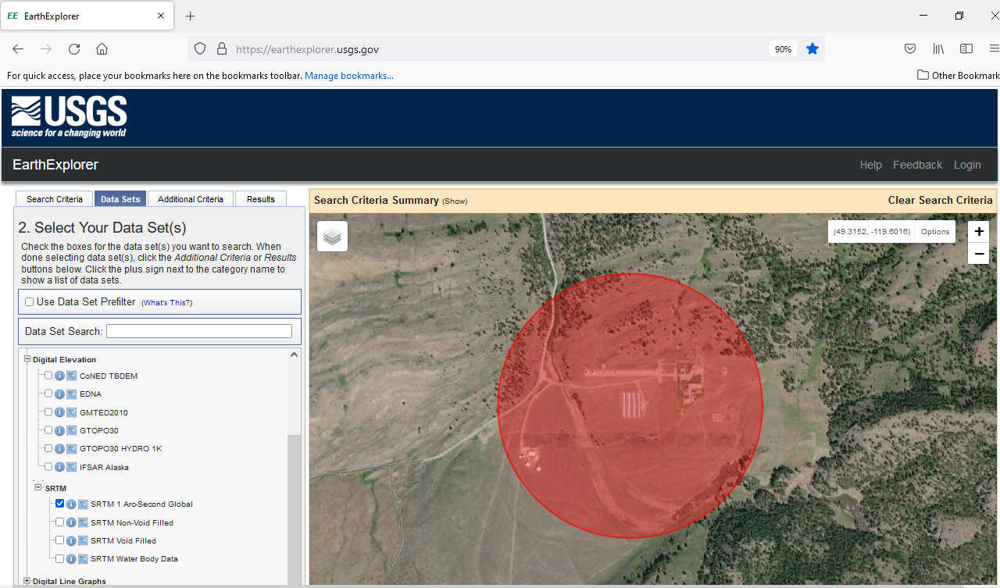
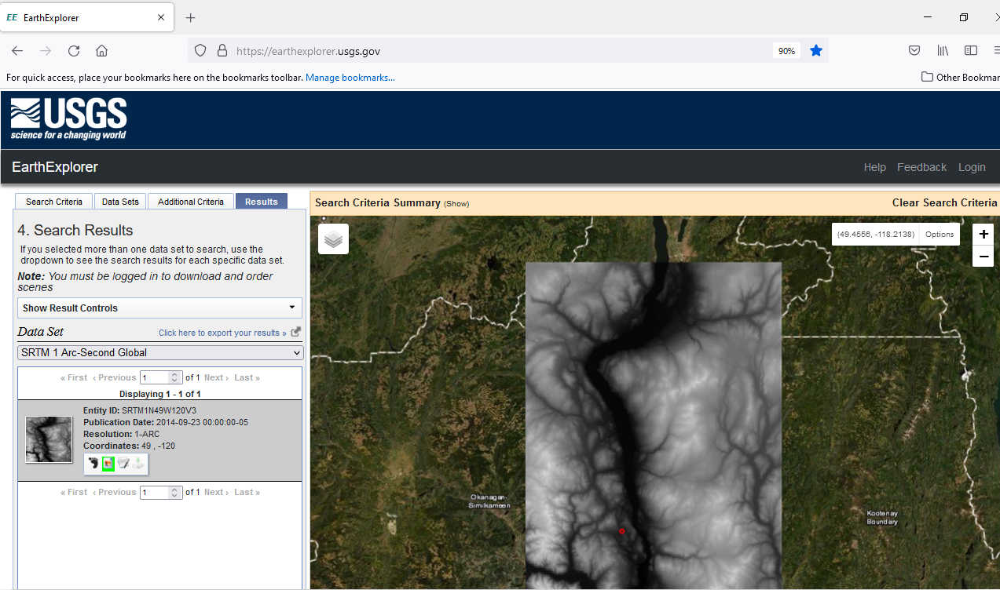
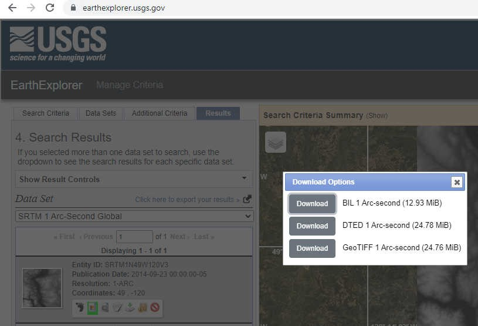
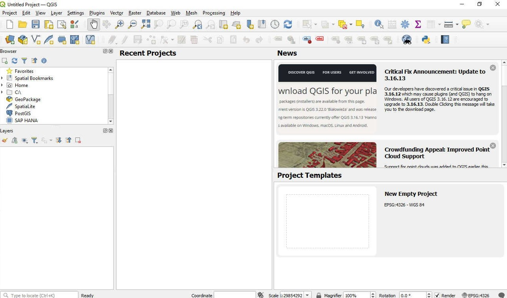
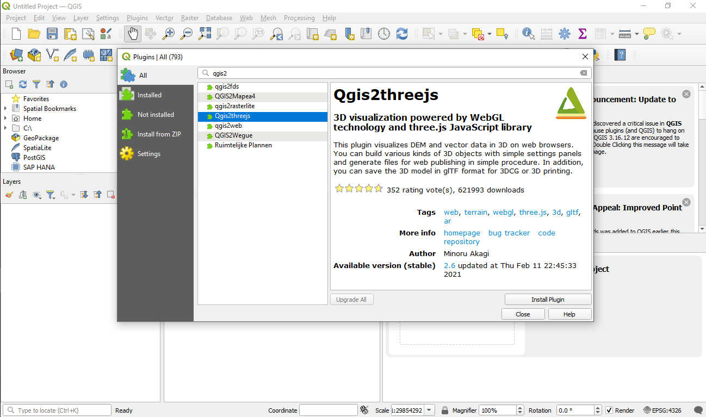
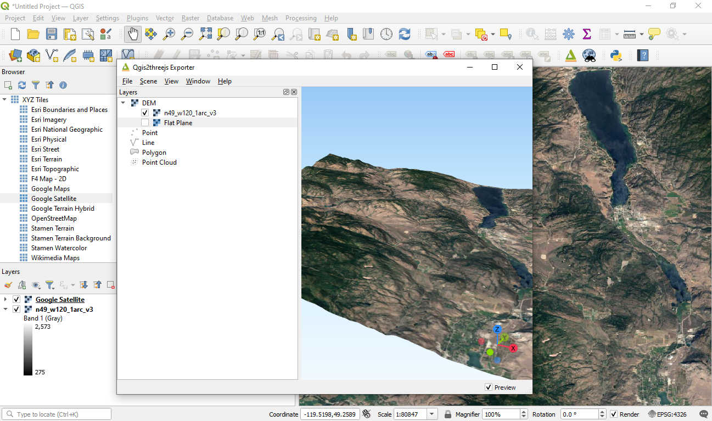
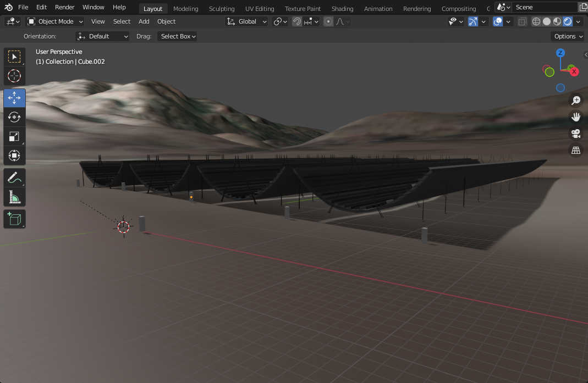
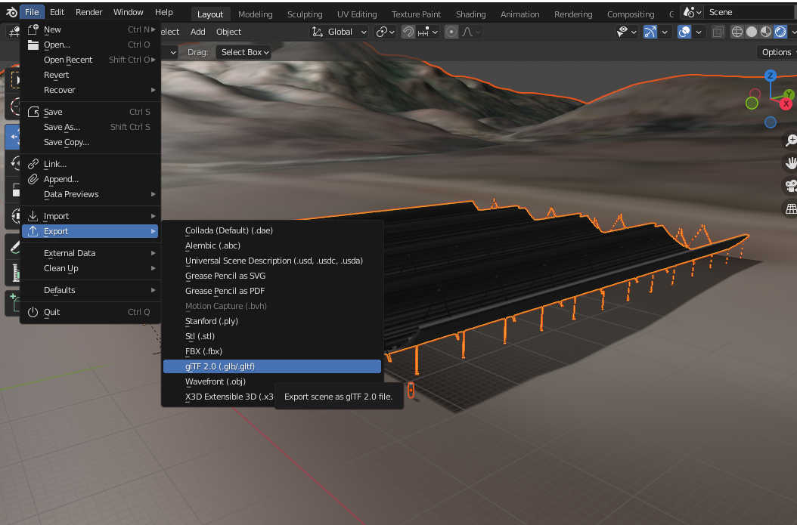

# Threejs-VR-Astronomical-Observatories (June 2022 update)
An experiment to recreate VR experience of astronomical observatories around the world.

The Canadian Hydrogen Intensity Mapping Experiment (CHIME) radio telescope is located in Penticton, British Columbia, Canada. Each telescope is a 100m x 20m cylindrical reflector. 

# Hardware

Oculus Quest (tested Quest One, update 41.0, Meta Quest browser 22.0) 

Three.js r141 (a minimal subset of r141) 

File threejs_vr_chime.html developed and tested on Raspberry Pi 4 and Raspberry Pi OS (2022) 

# Installation

No installation. In Oculus Quest, open Meta Quest browser and: 

[https://physicslibrary.github.io/Threejs-VR-Astronomical-Observatories/examples/threejs_vr_chime.html](https://physicslibrary.github.io/Threejs-VR-Astronomical-Observatories/examples/threejs_vr_chime.html)

Should work (no VR) on web browsers (latest Chrome, Firefox, Safari) on smartphones and desktop/laptop/Pi computers. Code threejs_vr_chime.html has threejs' orbit controls to allow camera to look around a target (one/two/pinch/slide fingers for mobile devices, and 3-button mouse for others).  

Code is minimal (no error checking or physics simulation). An experiment to jumpstart other experiments. 

# Pictorial hints on making 3D glTF from DEM geoTIFF. 

# Credits

This experiment is inspired from a collaboration with organizers, astrophysicists, educators, writers, programmers at 

https://www.stemxr.org/ 

ESA\_Gaia\_DR2\_AllSky\_Brightness\_Colour\_Cartesian\_2000x1000.png 
Date: 25 April 2018 
Satellite: Gaia 
Copyright: ESA/Gaia/DPAC, CC BY-SA 3.0 IGO 
[http://sci.esa.int/gaia/60196-gaia-s-sky-in-colour-equirectangular-projection/](http://sci.esa.int/gaia/60196-gaia-s-sky-in-colour-equirectangular-projection/) 

U.S. Geological Survey's Earth Explorer for DEM (Digital Elevation Map) data. 

https://earthexplorer.usgs.gov/ 

A free and open source geographic information system to merge DEM with satellite images to export 3D models (glTF format) for threejs. 

https://qgis.org/en/site/ 

A computer graphics tool to create, import, and export 3D models. 

https://www.blender.org/ 

chime-dec-7-2021.glb 
created using Blender 
(CC BY 4.0) 

chime-dem-dec-7-2021.glb 
derived from USGS GeoTIFF n49_w120_1arc_v3.tif, QGIS, and Blender. 

# References

[https://threejs.org/](https://threejs.org/) 

https://chime-experiment.ca/en 

 Copyright (c) 2021 Hartwell Fong
